# Databricks Lakehouse Medallion Pipeline

Portfolio-grade Data Engineering project using **Apache Spark, PySpark, Spark SQL, Databricks, Delta Lake, Unity Catalog, and Photon**.

**E-commerce Orders CSV → Bronze → Silver → Gold**

The project covers ingestion, schema handling, incremental processing / CDC, SCD Type 2 recovery, data quality, reliability and controlled-failure testing, monitoring, troubleshooting, and Spark performance tuning with measured evidence.

---

## Technology Stack

- Apache Spark / PySpark
- Spark SQL
- Databricks
- Delta Lake
- Unity Catalog
- Photon
- Medallion Architecture
- Delta MERGE / UPSERT
- Delta Change Data Feed concepts

---

## Source Dataset

Main dataset: E-commerce Orders CSV

Observed source characteristics:

- ~5,249 rows
- ~65 source columns
- Source column names include spaces and special characters
- Initial Delta ingestion hit `DELTA_INVALID_CHARACTERS_IN_COLUMN_NAMES`

The pipeline therefore normalizes column names before the Bronze Delta write.

---

## Architecture

Detailed Mermaid architecture:

[`docs/architecture/lakehouse_architecture.md`](docs/architecture/lakehouse_architecture.md)

High-level flow:

```text
E-commerce Orders CSV
        |
        v
Bronze: workspace.bronze.orders_raw
        |
        v
Silver: workspace.silver.orders_clean
        |
        v
Gold:
- fact_order_lines
- dim_product
- dim_sku
- daily_sales
- channel_performance
        |
        +--> Incremental / CDC
        +--> SCD2 / Recovery
        +--> Data Quality
        +--> Reliability / Failure Testing
        +--> Monitoring / Audit
        +--> Troubleshooting
        +--> Performance Tuning
```

---

## Bronze Layer

Primary table:

```text
workspace.bronze.orders_raw
```

Evidence:

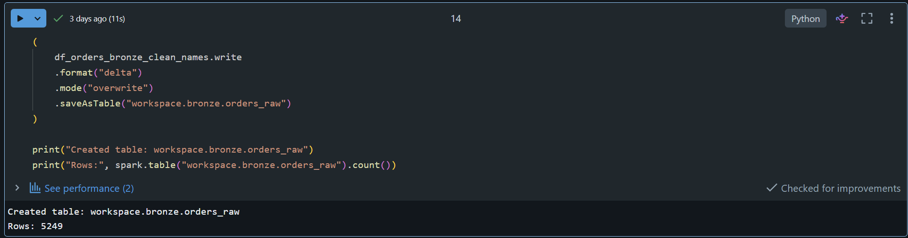

Final evidence shows:

```text
Created table: workspace.bronze.orders_raw
Rows: 5249
```

---

## Silver Layer

Primary table:

```text
workspace.silver.orders_clean
```

Evidence:

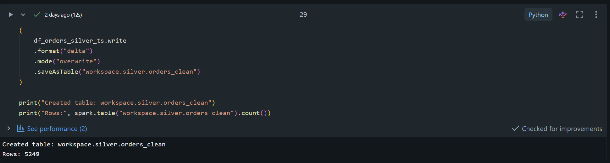

Final evidence shows:

```text
Created table: workspace.silver.orders_clean
Rows: 5249
```

---

## Gold Layer

Important Gold objects include:

```text
workspace.gold.fact_order_lines
workspace.gold.dim_product
workspace.gold.dim_sku
workspace.gold.daily_sales
workspace.gold.channel_performance
```

Gold fact evidence:

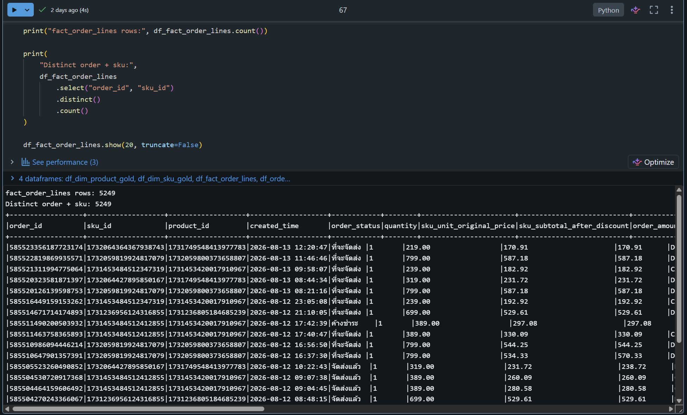

Observed validation:

```text
fact_order_lines rows: 5249
Distinct order + sku: 5249
```

This supports the intended `(order_id, sku_id)` grain in the final run.

---

## Incremental Processing / CDC

Checkpoint object:

```text
workspace.gold.cdf_checkpoint
```

CDF evidence:

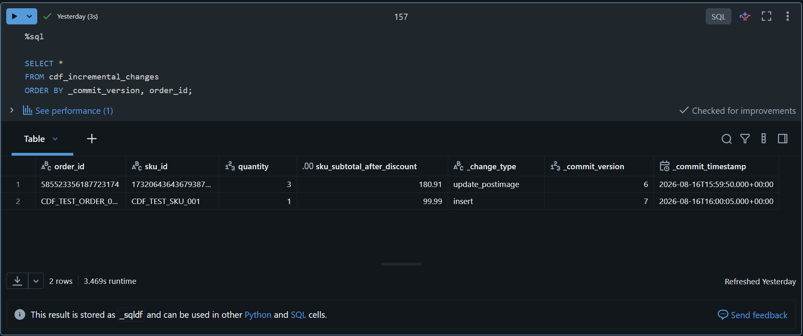

Observed CDF fields include:

```text
_change_type
_commit_version
_commit_timestamp
```

with change types such as:

```text
update_postimage
insert
```

Checkpoint decision evidence:

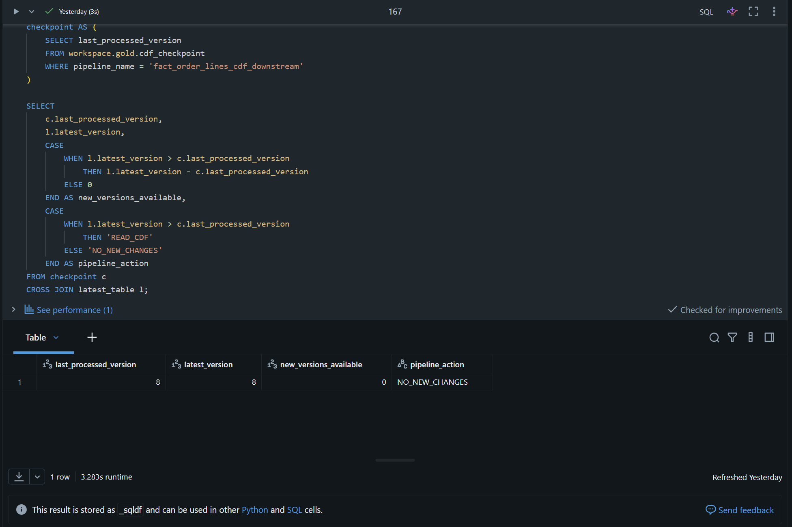

Observed decision:

```text
last_processed_version = 8
latest_version         = 8
new_versions_available = 0
pipeline_action        = NO_NEW_CHANGES
```

This provides evidence of checkpoint-driven incremental processing and a safe no-op when no new Delta version is available.

---

## SCD Type 2 / Recovery

Recovery sandbox:

```text
workspace.gold.dim_sku_scd2_recovery_sandbox
```

Evidence:

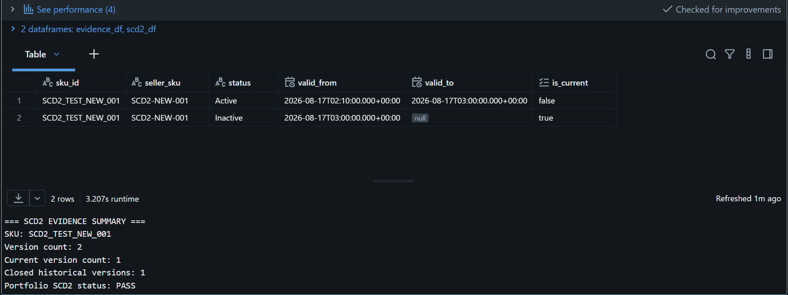

Final validation:

```text
Version count: 2
Current version count: 1
Closed historical versions: 1
Portfolio SCD2 status: PASS
```

Additional lifecycle validation:

```text
Duplicate current SKU count : 0
Current rows with valid_to   : 0
Closed rows missing valid_to : 0
SCD2 validation status       : PASS
```

---

## Data Quality

Persisted summary:

```text
workspace.gold.data_quality_summary
```

Evidence:

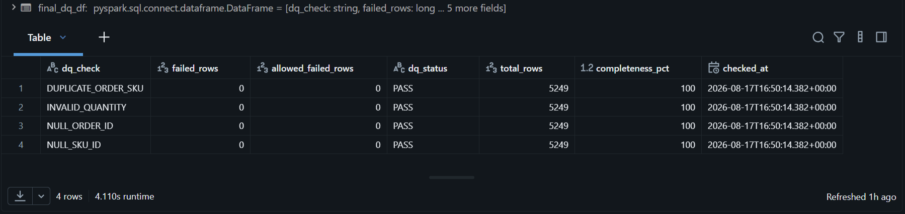

Persisted checks:

| Check | Result |
|---|---|
| NULL_ORDER_ID | PASS |
| NULL_SKU_ID | PASS |
| DUPLICATE_ORDER_SKU | PASS |
| INVALID_QUANTITY | PASS |

Observed summary:

```text
total_rows       = 5249
completeness_pct = 100
```

The persisted summary proves these four checks. Additional Data Quality behavior is demonstrated separately through the controlled reliability tests below, including NULL thresholds, referential integrity, range validation, failed-record routing, and pipeline decisions.

---

## Reliability & Controlled-Failure Testing

The reliability extension tests the pipeline as a production Data Engineer would: establish a known-good baseline, inject a controlled failure, detect it, apply a pipeline decision, recover, run regression checks, and reconcile the final data.

```text
BASELINE
    ↓
CONTROLLED FAILURE
    ↓
DETECT / BLOCK / ROUTE
    ↓
ROOT CAUSE / RECOVERY POLICY
    ↓
RECOVERY
    ↓
REGRESSION
    ↓
RECONCILIATION
```

The tests are read-only/in-memory unless an isolated sandbox is explicitly used, and production tables are not modified by the controlled-failure scenarios.

### Executive Reliability Result

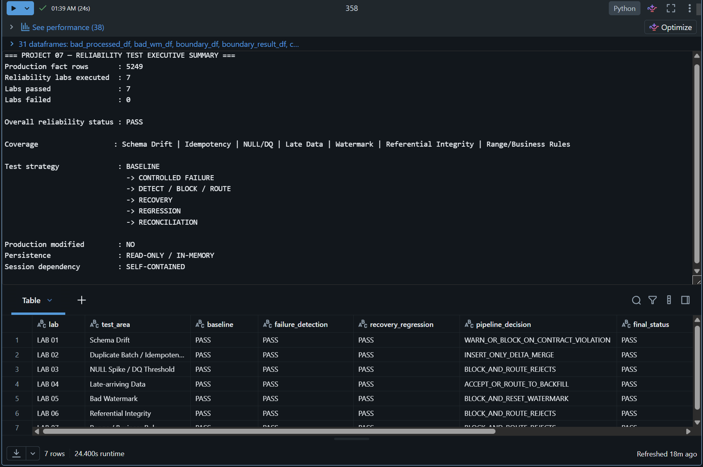

Observed executive result:

```text
Production fact rows       : 5249
Reliability labs executed  : 7
Labs passed                : 7
Labs failed                : 0
Overall reliability status : PASS
```

### Reliability Lab Coverage

| Lab | Test Area | Controlled Failure / Risk | Recovery or Prevention | Evidence | Result |
|---|---|---|---|---|---|
| 01 | Schema Drift | Added column, missing `order_id`, `created_time` datatype drift | Drop unapproved column, correct source, restore approved type | `lab01_schema_drift.png` | PASS |
| 02 | Duplicate Batch / Idempotency | Naive replay grows 50 rows to 100 and creates 50 duplicate groups | Insert-only Delta MERGE; replay MERGEs produce zero changes | `lab02_idempotency_delta_merge.png` | PASS |
| 03 | NULL Spike / DQ Threshold | 5% controlled NULL spike | Reject invalid rows, correct source, reprocess | `lab03_null_spike_dq_threshold.png` | PASS |
| 04 | Late-arriving Data | On-time, late-within-tolerance, and too-late events | Accept/reconcile or route to reviewed backfill | `lab04_late_arriving_data.png` | PASS |
| 05 | Bad Watermark | Watermark advanced too far and skips 2 of 3 incoming records | Reset to last good watermark and recover missing keys only | `lab05_bad_watermark.png` | PASS |
| 06 | Referential Integrity | Controlled orphan `product_id` | Block/reject, correct reference, reprocess; no fake parent created | `lab06_referential_integrity.png` | PASS |
| 07 | Range / Business Rule | `quantity = 0` and `quantity = -1` | Reject, correct source, reprocess; no business value invented | `lab07_range_business_rule.png` | PASS |

### Lab 01 — Schema Drift

Evidence: [`lab01_schema_drift.png`](docs/screenshots/reliability/lab01_schema_drift.png)

```text
Dataset rows          : 5249
Controlled scenarios  : 4
Schema drift detected : YES
Normalization         : PASS
Reconciliation        : 4/4 PASS
Final status          : PASS
```

The test covers an unexpected column, a missing required key, and a datatype change. Recovery returns the data to the approved schema contract and verifies row, schema, and data reconciliation.

### Lab 02 — Duplicate Batch / Idempotency

Evidence: [`lab02_idempotency_delta_merge.png`](docs/screenshots/reliability/lab02_idempotency_delta_merge.png)

```text
Controlled failure     : NAIVE_APPEND_REPLAY
Failure evidence       : 50 -> 100 rows
Duplicate groups       : 50 during failure
Recovery               : PASS
Prevention             : INSERT_ONLY_DELTA_MERGE
Final rows             : 50
Final distinct keys    : 50
Final duplicate groups : 0
MERGE history inspected: 2
Zero-change MERGEs     : 2
Final Lab status       : PASS
```

The business key is `(order_id, sku_id)`. An insert-only Delta MERGE prevents duplicate insertion during replay and demonstrates idempotent behavior in the isolated sandbox.

### Lab 03 — NULL Spike / DQ Threshold

Evidence: [`lab03_null_spike_dq_threshold.png`](docs/screenshots/reliability/lab03_null_spike_dq_threshold.png)

```text
0% NULL      -> PASS  / CONTINUE
1% NULL      -> WARN  / REVIEW
5% NULL      -> ERROR / BLOCK_AND_ROUTE_REJECTS
```

Controlled evidence:

```text
NULL spike tested  : 5.00%
Failure routing    : 95 VALID / 5 REJECTED
Recovery policy    : CORRECT_SOURCE_AND_REPROCESS
NULL after recovery: 0
Reconciliation     : PASS
Final Lab status   : PASS
```

### Lab 04 — Late-arriving Data

Evidence: [`lab04_late_arriving_data.png`](docs/screenshots/reliability/lab04_late_arriving_data.png)

```text
ON_TIME               -> CONTINUE
LATE_WITHIN_TOLERANCE -> ACCEPT_AND_RECONCILE
TOO_LATE              -> ROUTE_TO_BACKFILL_REVIEW
```

Observed evidence:

```text
Routing scenarios passed  : 3/3
Boundary scenarios passed : 5/5
Recovery policy           : REVIEW_THEN_BACKFILL
Backfill reconciliation   : PASS
Final accounted records   : 3/3
Duplicate groups          : 0
Final Lab status          : PASS
```

### Lab 05 — Bad Watermark

Evidence: [`lab05_bad_watermark.png`](docs/screenshots/reliability/lab05_bad_watermark.png)

```text
Controlled incoming rows : 3
Correct WM processed     : 3
Bad WM processed         : 1
Records skipped          : 2
Failure completeness     : 33.33%
Data loss detected       : YES
Root cause               : WATERMARK_ADVANCED_TOO_FAR
Pipeline decision        : BLOCK_AND_RESET_WATERMARK
```

Recovery evidence:

```text
Rows visible after reset : 3
Missing rows recovered   : 2
Final recovered rows     : 3
Final distinct keys      : 3
Duplicate groups         : 0
Recovery completeness    : 100.00%
Recovery policy          : RESET_TO_LAST_GOOD_WATERMARK
Replay policy            : RECOVER_MISSING_KEYS_ONLY
Final Lab status         : PASS
```

### Lab 06 — Referential Integrity

Evidence: [`lab06_referential_integrity.png`](docs/screenshots/reliability/lab06_referential_integrity.png)

```text
Detected orphan rows        : 1
Rejected routed rows        : 1
Severity                    : ERROR
Pipeline decision           : BLOCK_AND_ROUTE_REJECTS
Controlled failure detected : PASS
Recovery policy             : CORRECT_REFERENCE_AND_REPROCESS
Fake parent created         : NO
Recovered rows              : 20
Orphans after recovery      : 0
Duplicate groups            : 0
Full data match             : True
Final Lab status            : PASS
```

NULL foreign keys and non-NULL orphan references are treated as separate validation concerns. This lab tests the latter: a populated foreign key whose parent does not exist.

### Lab 07 — Range / Business Rule Validation

Business rule:

```text
quantity >= 1
```

Evidence: [`lab07_range_business_rule.png`](docs/screenshots/reliability/lab07_range_business_rule.png)

Controlled failures:

```text
quantity = -1 -> NEGATIVE_QUANTITY
quantity =  0 -> ZERO_QUANTITY
```

Observed behavior:

```text
Severity                    : ERROR
Pipeline decision           : BLOCK_AND_ROUTE_REJECTS
Controlled failure detected : PASS
Recovery policy             : CORRECT_SOURCE_AND_REPROCESS
Quantity value invented     : NO
Invalid rows after recovery : 0
Range regression            : PASS
Full data match             : True
Final Lab status            : PASS
```

The recovery intentionally avoids converting invalid values to `1` without source evidence. The invalid rows are rejected, the trusted source is corrected, and the batch is reprocessed.

---

## Monitoring / Audit

Audit table:

```text
workspace.gold.pipeline_run_audit
```

Success evidence:

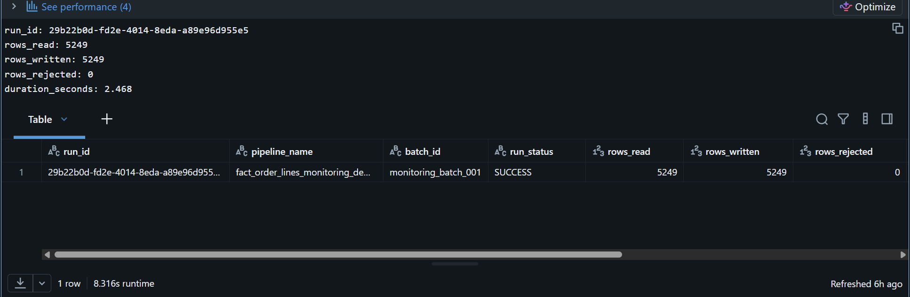

Observed successful run:

```text
batch_id      = monitoring_batch_001
run_status    = SUCCESS
rows_read     = 5249
rows_written  = 5249
rows_rejected = 0
```

The audit model supports run-level evidence such as status, failed step, error message, rows read/written/rejected, batch ID, timestamps, and duration.

---

## Troubleshooting / Failure Evidence

Failure evidence:

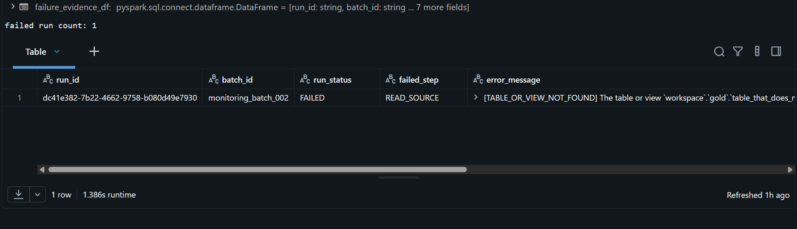

Observed failure:

```text
failed run count = 1
batch_id         = monitoring_batch_002
run_status       = FAILED
failed_step      = READ_SOURCE
error_message    = TABLE_OR_VIEW_NOT_FOUND
```

The project also contains controlled failure and recovery scenarios for schema drift, duplicate replay, NULL spikes, late-arriving data, watermark failures, referential integrity, and invalid business-rule values.

---

## Spark Performance Tuning

Benchmark tables:

```text
workspace.gold.spark_performance_benchmark
workspace.gold.spark_performance_improvement_summary
```

### Benchmark Coverage

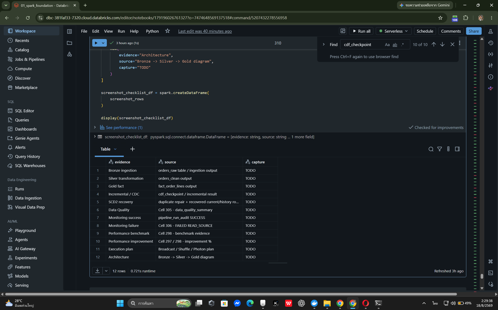

Evidence rows by experiment:

```text
data_skew              = 3
data_skipping          = 2
join_strategy          = 2
materialization        = 2
partitioning_strategy  = 2
shuffle_partitions     = 4
small_files            = 2
```

Total benchmark evidence rows: `17`.

### Improvement Summary

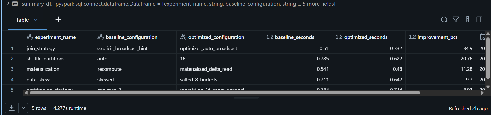

| Experiment | Before | After | Improvement |
|---|---:|---:|---:|
| Join strategy | 0.510 s | 0.332 s | 34.90% |
| Shuffle partitions | 0.785 s | 0.622 s | 20.76% |
| Materialization | 0.541 s | 0.480 s | 11.28% |
| Data skew mitigation | 0.711 s | 0.642 s | 9.70% |
| Partitioning strategy | 0.784 s | 0.714 s | 8.93% |

These are workload-specific measurements, not universal Spark tuning rules.

---

## Spark Physical Plan Evidence

### Hash Partitioning

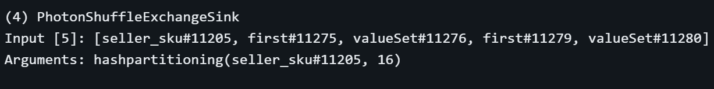

### Single Partition Exchange

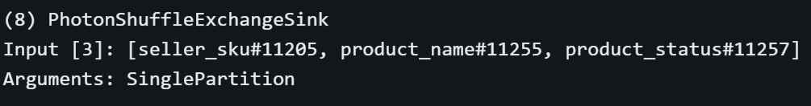

### Executor Broadcast

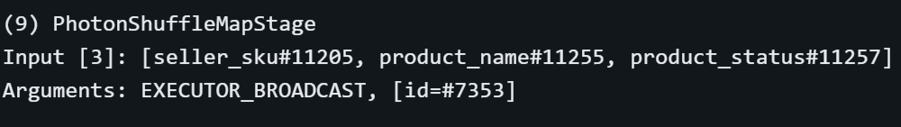

### Photon Broadcast Hash Join

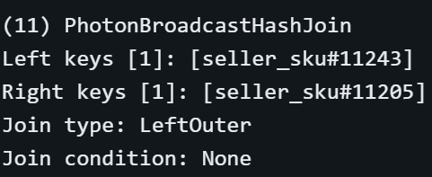

### Photon Support

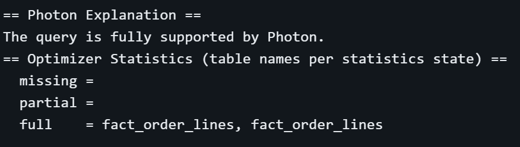

Observed plan evidence includes:

```text
PhotonShuffleExchangeSink
hashpartitioning(..., 16)

PhotonShuffleMapStage
Arguments: EXECUTOR_BROADCAST

PhotonBroadcastHashJoin
Join type: LeftOuter

== Photon Explanation ==
The query is fully supported by Photon.
```

---

## Repository Structure

```text
databricks-lakehouse-medallion-pipeline/
│
├── README.md
├── .gitignore
├── notebooks/
│   └── 01_spark_foundation.py
├── src/
├── sql/
└── docs/
    ├── architecture/
    │   └── lakehouse_architecture.md
    └── screenshots/
        ├── bronze/
        ├── silver/
        ├── gold/
        ├── incremental/
        ├── scd2/
        ├── data-quality/
        ├── monitoring/
        ├── troubleshooting/
        ├── performance/
        └── reliability/
            ├── reliability_test_executive_summary.png
            ├── lab01_schema_drift.png
            ├── lab02_idempotency_delta_merge.png
            ├── lab03_null_spike_dq_threshold.png
            ├── lab04_late_arriving_data.png
            ├── lab05_bad_watermark.png
            ├── lab06_referential_integrity.png
            └── lab07_range_business_rule.png
```

---

## Portfolio Evidence Summary

| Capability | Evidence |
|---|---|
| Bronze ingestion | `bronze_ingestion.png` |
| Silver transformation | `silver_transformation.png` |
| Gold fact modeling | `gold_fact_order_lines.png` |
| CDC changes | `cdf_incremental_changes.png` |
| Checkpoint decision | `cdf_checkpoint_decision.png` |
| SCD2 recovery | `scd2_recovery.png` |
| Data quality summary | `data_quality_summary.png` |
| Monitoring success | `pipeline_success.png` |
| Failure troubleshooting | `read_source_failure.png` |
| Reliability executive summary | `reliability_test_executive_summary.png` |
| Schema drift recovery | `lab01_schema_drift.png` |
| Delta MERGE idempotency | `lab02_idempotency_delta_merge.png` |
| NULL threshold / failed routing | `lab03_null_spike_dq_threshold.png` |
| Late-arriving data / backfill | `lab04_late_arriving_data.png` |
| Bad watermark recovery | `lab05_bad_watermark.png` |
| Referential integrity / orphan routing | `lab06_referential_integrity.png` |
| Range / business-rule validation | `lab07_range_business_rule.png` |
| Performance benchmark | `performance_benchmark.png` |
| Performance improvements | `performance_improvement_summary.png` |
| Hash partitioning plan | `01_shuffle_hashpartitioning_16.png` |
| Single partition exchange | `02_shuffle_single_partition.png` |
| Executor broadcast | `03_executor_broadcast.png` |
| Broadcast hash join | `04_photon_broadcast_hash_join.png` |
| Photon support | `05_photon_fully_supported.png` |

---

## Engineering Approach

```text
EXPLAIN
→ IMPLEMENT
→ TEST
→ INJECT FAILURE
→ DETECT
→ TROUBLESHOOT
→ RECOVER
→ REGRESSION TEST
→ RECONCILE
→ OPTIMIZE
→ PROVE WITH EVIDENCE
```

The goal is not only to make a notebook run successfully, but to demonstrate how a Data Engineer validates behavior under both normal and failure conditions.

---

## Current Status

**Status: COMPLETE**

The core engineering implementation and reliability extension are complete and documented with portfolio evidence.

Final repository validation covers:

- Bronze, Silver, and Gold implementation and evidence
- Incremental / CDC and checkpoint-driven no-op behavior
- SCD Type 2 lifecycle, replay guard, recovery, and validation
- Persisted Data Quality metrics
- Reliability testing across 7 controlled-failure labs
- Schema drift detection and recovery
- Duplicate replay and Delta MERGE idempotency
- NULL thresholding and failed-record routing
- Late-arriving data classification and backfill reconciliation
- Bad watermark data-loss detection and recovery
- Referential integrity and orphan-record routing
- Range and business-rule validation
- Monitoring success and controlled pipeline failure evidence
- Spark performance benchmarks and before/after measurements
- Spark physical-plan and Photon evidence
- Mermaid Lakehouse architecture rendered on GitHub
- Public GitHub repository using the `main` branch

This repository is portfolio-ready.
