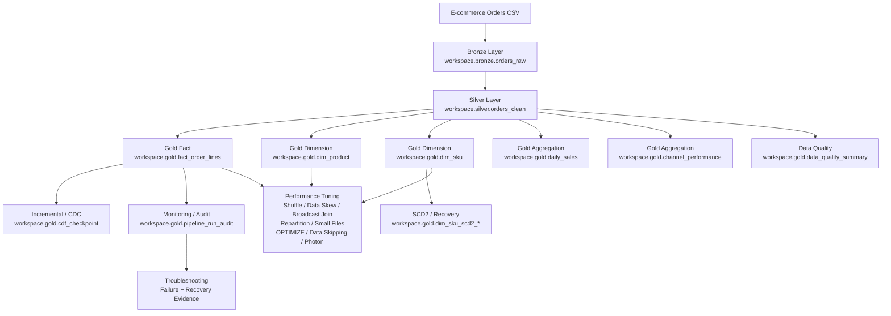

# PROJECT 07 — Databricks Lakehouse Architecture

```mermaid
flowchart TD

    A[E-commerce Orders CSV]
    B[Bronze Layer<br/>workspace.bronze.orders_raw]
    C[Silver Layer<br/>workspace.silver.orders_clean]

    D1[Gold Fact<br/>workspace.gold.fact_order_lines]
    D2[Gold Dimension<br/>workspace.gold.dim_product]
    D3[Gold Dimension<br/>workspace.gold.dim_sku]
    D4[Gold Aggregation<br/>workspace.gold.daily_sales]
    D5[Gold Aggregation<br/>workspace.gold.channel_performance]

    E1[Incremental / CDC<br/>workspace.gold.cdf_checkpoint]
    E2[SCD2 / Recovery<br/>workspace.gold.dim_sku_scd2_*]

    F1[Data Quality<br/>workspace.gold.data_quality_summary]
    F2[Monitoring / Audit<br/>workspace.gold.pipeline_run_audit]
    F3[Troubleshooting<br/>Failure + Recovery Evidence]

    G[Performance Tuning<br/>Shuffle / Data Skew / Broadcast Join<br/>Repartition / Small Files<br/>OPTIMIZE / Data Skipping / Photon]

    A --> B
    B --> C

    C --> D1
    C --> D2
    C --> D3
    C --> D4
    C --> D5

    D1 --> E1
    D3 --> E2

    C --> F1
    D1 --> F2
    F2 --> F3

    D1 --> G
    D2 --> G
    D3 --> G
```
